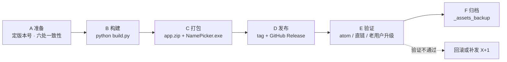

# 发版工作流（Release Workflow）

> 本文件是发版的**唯一操作手册**（面向人与协作者）。
> 更新链路的实现细节见 [.trae/documents/runtime-logic-overview.md](.trae/documents/runtime-logic-overview.md)。

---

## 0. 概览



六个阶段，每个阶段都有**通过条件**，不满足就不要进入下一阶段。

| 阶段 | 动作 | 通过条件 |
|---|---|---|
| A 准备 | 定版本号、改 `LOCAL_VERSION`、核对六处一致 | 六处版本号完全一致 |
| B 构建 | `python build.py` | 退出码 0，`dist/RandomNamePicker/` 含两个 exe + 依赖 + `data/` |
| C 打包 | 打 `app.zip`、编译 `1.iss` | `app.zip` 合规；安装器产物存在 |
| D 发布 | 提交、打 tag、建 Release、传资产 | Release 上两个资产可下载 |
| E 验证 | 4 项验证 | 全部通过 |
| F 归档 | 资产 + 说明回存 | `release/_assets_backup/v{ver}/` 完整 |

---

## 1. 目录与资产约定

| 名称 | 路径 | 说明 |
|---|---|---|
| 版本目录 | `release/v{M}.{N}[.{X}]/` | 放该版 `1.iss` 与编译出的安装器 |
| 更新包 | `release/v{ver}/app.zip` | 用户端自动更新用，**顶层直放** |
| 安装器 | `release/v{ver}/NamePicker.exe` | Inno Setup 产物（`OutputBaseFilename=NamePicker`） |
| 资产备份 | `release/_assets_backup/v{ver}/` | Release 资产留档（`app.zip` + `NamePicker.exe`） |
| 构建输出 | `dist/RandomNamePicker/` | `build.py` 产物 |

版本控制策略：`.gitignore` **只忽略** `release/**/*.exe`、`release/**/*.zip`；
`1.iss`（打包配方）与 `*-release.json`（资产元数据）**纳入版本管理**。
`dist/`、`build/` 整体忽略。

---

## 2. 版本号规则

`v{M}.{N}` 或 `v{M}.{N}.{X}`，`X` 为单字母 `a`–`z`，`z` 用尽进位到 `{N+1}`。

| 改动性质 | 版本号 |
|---|---|
| 主程序（`app.py`）功能 / 界面 / 数据格式变化，或需强制升级 | `N+1`（`v2.0` → `v2.1`） |
| 仅修 `helper.py` 更新链路、打包脚本、文案 | `X` 顺延（`v2.1` → `v2.1.a`） |
| `z` 用尽 | `v2.1.z` → `v2.2` |

比较逻辑：`helper.py` 的 `_parse_version` / `_version_gt`（先 M，再 N，最后字母）。
**版本号只增不减**；**不要移动已推送的 tag**。

---

## 3. 阶段 A · 准备

### A1 前置环境
- Python 虚拟环境可用（`.venv`），已装 PyInstaller；
- **Inno Setup 6 已安装**（提供 `ISCC.exe`，命令行编译用；未安装则只能用 IDE 手动 Compile）；
- 网络能访问 `github.com`（推送与 Release 上传都需要；本项目环境曾出现直连被阻断）。

### A2 定版本号并按 §2 决策表确认

### A3 改 `LOCAL_VERSION`
`helper.py` 顶部：`LOCAL_VERSION = '...'` → 本版版本号。

### A4 核对六处一致性（**发版最易出错处**）

| # | 位置 | 值示例 |
|---|---|---|
| 1 | `helper.py` 的 `LOCAL_VERSION` | `v2.1` |
| 2 | git tag | `v2.1` |
| 3 | GitHub Release 的 tag | `v2.1` |
| 4 | 资产目录名 | `release/v2.1/` |
| 5 | `1.iss` 的 `MyAppVersion` | `v2.1` |
| 6 | `1.iss` 的 `OutputDir` | `...\release\v2.1` |

```powershell
Select-String -Path helper.py -Pattern "^LOCAL_VERSION"
Get-ChildItem release -Directory | Select-Object Name
Select-String -Path release\v2.1\1.iss -Pattern "MyAppVersion|OutputDir"
git ls-remote --tags origin          # 确认新版本号未被占用
```

> 第 1 项最关键：不推进，老用户永远收不到更新；推进过度，用户会被"降级式"更新误导。

**阶段通过条件**：六处一致。

---

## 4. 阶段 B · 构建

```powershell
python -m py_compile app.py helper.py build.py versiontest.py   # 静态检查
python versiontest.py                                          # 版本比较 9/9 + 能取到远端最新 tag
python build.py                                               # 退出码必须为 0
```

`build.py` 模式：默认全部 / `--helper` 只编更新器 / `--main` 只编主程序；
`--all` 不能与 `--helper`/`--main` 同用。

**通过条件**：`dist/RandomNamePicker/` 下同时存在
`helper.exe`、`RandomNamePicker.exe`、依赖目录（`webview/` `clr_loader/` `pythonnet/` …）与 `data/`。

---

## 5. 阶段 C · 打包

### C1 组装资产目录

```powershell
New-Item -ItemType Directory -Force release\v2.1
Copy-Item release\v2.0\1.iss release\v2.1\1.iss     # 以上一版为模板
```
再按 §7 修改 `1.iss` 的 3 处。

### C2 打 `app.zip`

```powershell
Compress-Archive -Path dist\RandomNamePicker\* -DestinationPath release\v2.1\app.zip -Force
```

必须满足（与 `helper.py` 的 `safe_extract` 强耦合）：

| 项 | 要求 | 原因 |
|---|---|---|
| 根层结构 | **无包装目录** | 包装目录会被平铺到安装目录，造成嵌套错位 |
| `helper.exe` | 必须有 | 更新器本体，缺失则下次无法更新 |
| `RandomNamePicker.exe` | 必须有 | 主程序 |
| 依赖目录 | 必须有 | 运行时依赖 |
| `data/` | **不要有** | 用户数据；保留白名单会跳过，但不该入包 |
| `*.log` | 不要有 | 同上 |

体检命令见 §9。

### C3 编译安装器

用 Inno Setup 打开 `release/v2.1/1.iss` → **Compile**；或：

```powershell
& "C:\Program Files (x86)\Inno Setup 6\ISCC.exe" release\v2.1\1.iss
```

**通过条件**：`release/v2.1/` 下同时有 `app.zip` 与 `NamePicker.exe`。

### C4 本地冒烟（发布前最后一关）
- 把 `app.zip` 解压到空目录 → 双击 `helper.exe`，确认能拉起主程序；
- 或装一次安装器，确认快捷方式指向 `helper.exe`，点名功能正常。

---

## 6. 阶段 D · 发布

```powershell
git add app.py helper.py build.py versiontest.py release/v2.1/1.iss   # 按实际改动挑，不要 git add -A
git commit -m "release: v2.1"
git tag -a v2.1 -m "v2.1"
git push origin main
git push origin v2.1
```

然后在 GitHub 以 tag `v2.1` 建 Release，上传两个资产：

| 资产 | 来源 | 注意 |
|---|---|---|
| `app.zip` | `release/v2.1/app.zip` | **名称必须精确为 `app.zip`**（`helper.py` 按约定名拼直链） |
| `NamePicker.exe` | `release/v2.1/NamePicker.exe` | |

> GitHub 自动生成的 `Source code (zip)` 与我们的 `app.zip` 是两个不同文件，`helper` 只认 `app.zip`。

**通过条件**：Release 页面两个资产均处于可下载状态。

---

## 7. 阶段 E · 验证（4 项，缺一不可）

1. **atom 已更新**：`python versiontest.py` 显示"最新版本"= 本版；
2. **直链可用**：`curl.exe -sIL https://github.com/BaiZiDog/RandomNamePicker/releases/download/v2.1/app.zip` 末尾为 `200`；
3. **老版本能升级**：把本地 `LOCAL_VERSION` 临时调低 → 跑 `helper.exe` → 确认能检测并完成更新；
4. **最新版直接启动**：本地 = 本版时，`helper.exe` 提示"已是最新版本"并直接启动主程序。

不通过 → 按 §10 处理。

---

## 8. 阶段 F · 归档

- 把 Release 的两个资产复制到 `release/_assets_backup/v2.1/`；
- 保存 Release 说明文本（可用 `gh release view v2.1 --json ...` 导出）。

---

## 9. `1.iss` 改动点与约定

每版固定改 3 处：

| 位置 | 说明 |
|---|---|
| `#define MyAppVersion` | 本版版本号 |
| `OutputDir=` | 指向本版资产目录 `...\release\v{M}.{N}` |
| `[Files] Source=` | 必须与 `dist\RandomNamePicker\` 对齐（`build.py` 用 `--contents-directory .`，依赖与 exe 平铺） |

当前构建的正确写法：

```
[Files]
Source: "D:\PythonProject\RandomNamePicker\dist\RandomNamePicker\helper.exe"; DestDir: "{app}"; Flags: ignoreversion
Source: "D:\PythonProject\RandomNamePicker\dist\RandomNamePicker\*"; DestDir: "{app}"; Flags: ignoreversion recursesubdirs createallsubdirs
```

**AppId 约定（重要）**：`AppId` 是 Inno 判断"是不是同一个程序"的唯一依据，
**各版必须完全一致**，否则新版会与旧版**并存安装**而不是覆盖升级。
本仓库统一使用以 v2.0 已发布安装为准的：

```
AppId={{5544B66A-CA07-4C55-9406-40B217CCA383}
```

> 历史版本 v1.5（`{9A25ACD3-…}`）、v1.5-fix（`{8679EAB0-…}`）各自换过 GUID，
> 那是并存问题的成因；它们的 `1.iss` 保留原样作为发布记录，**不要拿它们当模板**。
> 已经用旧 AppId 装过的用户，新版仍会与其并存 —— 需手动卸载旧版后重装。

其他已定稿的写法：
- `DefaultDirName={autopf}\{#MyAppName}`（不要写死盘符）；
- `MyAppExeName=helper.exe`（安装器的启动项必须是更新器，否则用户绕过更新链路）。

---

## 10. 失败处理与回滚

| 情形 | 处理 |
|---|---|
| 发布后发现严重问题，**尚无用户拉到新包** | 删 Release 与 tag（`gh release delete <tag> --yes`；`git push origin :refs/tags/<tag>`），修好后用**同一版本号**重发 |
| 已有用户拉到新包 | **不要删 tag/Release**（用户可能正在更新；删除会让直链 404、`atom` 取到旧版导致判断异常）→ **立即发 `X+1` 修复版** |
| 只想撤回安装器 | 删除 Release 上的 `NamePicker.exe` 资产，保留 `app.zip`（更新链路不依赖安装器） |
| `git push` 连不上 `github.com` | 本机曾出现直连被阻断；确认网络/代理后重试 `git push origin main`，提交在本地不会丢 |

> 已发布过的版本号不要复用。

---

## 11. 检查清单（发布时逐项勾选）

```
[ ] A1 环境就绪：venv + PyInstaller + Inno Setup 6（ISCC.exe 可用）+ 能访问 github.com
[ ] A2 版本号已定（按 §2 决策表）
[ ] A3 helper.py 的 LOCAL_VERSION 已改
[ ] A4 六处版本一致性已核对（§3 命令）
[ ] B  python -m py_compile 4 文件通过
[ ] B  python versiontest.py 通过
[ ] B  python build.py 退出码 0；dist/RandomNamePicker/ 含两个 exe + 依赖 + data/
[ ] C1 release/v{ver}/ 已建，1.iss 已从上一版复制
[ ] C2 1.iss 三处已改（MyAppVersion / OutputDir / [Files] Source）
[ ] C2 AppId 未改动（沿用 §9 的唯一值）
[ ] C2 app.zip 已打；体检通过（无包装目录、含两个 exe、不含 data/）
[ ] C3 NamePicker.exe 已编译到 release/v{ver}/
[ ] C4 本地冒烟：解压 app.zip 跑通 helper.exe → 主程序
[ ] D  已提交并打 tag，main 与 tag 均已 push
[ ] D  Release 已建，app.zip 与 NamePicker.exe 均已上传
[ ] E1 versiontest.py 显示最新版本 = 本版
[ ] E2 直链返回 200
[ ] E3 旧版本能检测并完成更新
[ ] E4 最新版提示"已是最新版本"并直接启动
[ ] F  资产与 Release 说明已回存 release/_assets_backup/v{ver}/
```

### `app.zip` 体检命令

```powershell
.venv\Scripts\python.exe -c "
import zipfile
z = zipfile.ZipFile(r'release\v2.1\app.zip'); n = z.namelist()
print('条目数:', len(n))
print('根层条目(前 8):', n[:8])
print('含 helper.exe:', 'helper.exe' in n, '| 含主程序:', 'RandomNamePicker.exe' in n)
print('含 data/:', any(x.startswith('data/') for x in n), '（应为 False）')
"
```
（v2.0 资产的实测基准：334 个条目，根层为 `helper.exe` 等，无 `data/`。）

---

## 12. 常见坑

| 坑 | 后果 | 规避 |
|---|---|---|
| 忘记推进 `LOCAL_VERSION` | 老用户收不到更新 | 阶段 A3 + 清单 |
| 只更新 `app.zip`、没重编安装器 | 新装用户拿到旧代码 | C3 与 C2 必须同源同版 |
| `app.zip` 里多了一层包装目录 | 文件被平铺到安装目录，布局错乱 | C2 在 `dist/RandomNamePicker` 内部打包 |
| `app.zip` 里混入 `data/` | 用户名单可能被覆盖（白名单虽会跳过） | C2 体检 |
| 改了 `AppId` | 新旧版本并存安装 | §9 约定 |
| `DefaultDirName` 写死盘符 | 无该盘的机器安装失败 | 用 `{autopf}` |
| 安装器启动项设成主程序 | 用户绕过更新链路 | `MyAppExeName=helper.exe` |
| 发布后发现严重问题就删 tag | 已更新用户链路异常 | §10：已有用户时改为发 `X+1` |
